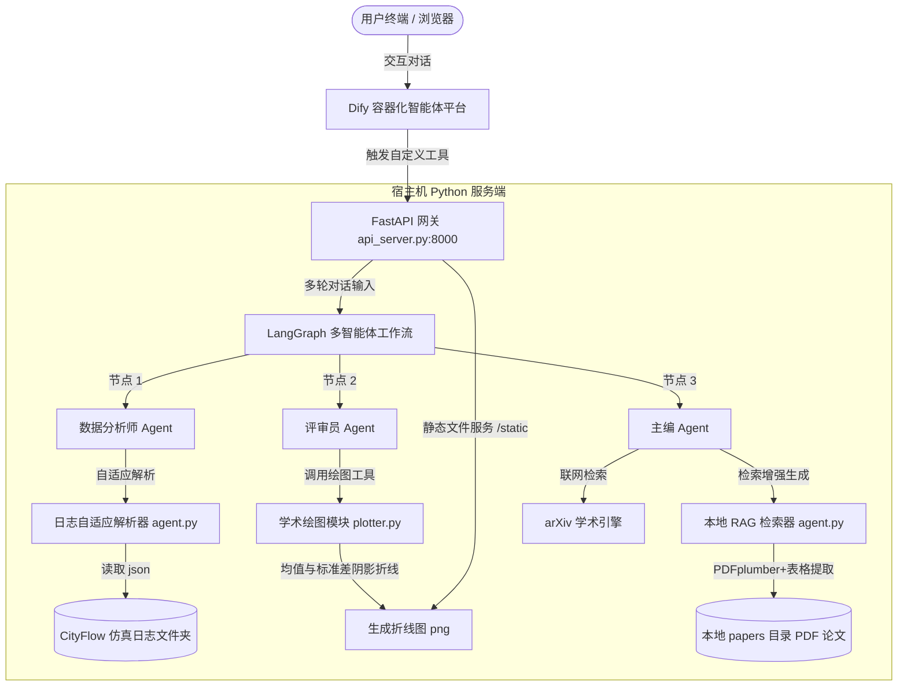

# Multi-Agent Traffic Signal Control Simulation, Validation & Academic RAG Analysis Platform
### 基于多智能体协同的交通信号控制仿真评估与学术分析系统

[](https://www.python.org/)
[](https://fastapi.tiangolo.com/)
[](https://github.com/langchain-ai/langgraph)
[](https://www.docker.com/)

本系统是一个专为城市交通信号控制（TSC）算法设计的**智能评估、可视化比对与学术论文分析平台**。系统打通了底层微观交通仿真环境（CityFlow）、最前沿的有环多智能体协同框架（LangGraph）以及低代码 AI 编排平台（Dify），实现从仿真日志提取、多模型种子指标对齐、学术均值标准差阴影折线绘制，到本地文献跨语言精准 RAG 学术对比的完整自动化工作流。

---

## ⚙️ 系统架构设计 (Architecture)

系统由**前端人机交互界面（Dify / Streamlit）**、**API 网关服务（FastAPI）**以及**多智能体核心执行引擎（LangGraph）**三层架构组成：



---

## 🌟 核心技术亮点 (Key Features)

### 1. 基于 LangGraph 的有环多智能体流转 (Stateful Multi-Agent Workflow)
* **角色分工**：定义了**分析师（Analyst）**、**评审员（Reviewer）**与**主编（Editor）**三个 Agent 节点。通过共享的 Graph State 传递数据与控制流。
* **人机协同（Human-in-the-loop）**：支持在主编生成最终学术报告前进行人工审查与修改反馈，提供图状态的中断与恢复机制。
* **Turn 隔离与会话管理**：设计了随机会话 ID 生成与历史会话流式清理机制，在完美继承多轮对话记忆的同时，彻底避免了上一轮执行数据的残留和交织。

### 2. 多日志 Schema 自适应数据解析引擎 (Adaptive Log Parser)
* 针对多种前沿强化学习算法（如 DQN, CoLight, MPLight）产生的结构迥异的仿真日志，设计了启发式自适应嗅探机制。
* 自动兼容 `round_debug`、`completed_history` 与 `delay_history` 等多种字段拓扑，实现吞吐量、平均旅行时间（ATT）以及平均延时指标的零配置提取。

### 3. 学术级折线对比绘图模块 (Academic Plotter with Std Shading)
* **Headless 后端保障**：强制配置 Matplotlib 非交互式 `Agg` 渲染后端，彻底解决在 Windows 多线程及 Streamlit 运行时环境下 GUI 主循环挂起的硬件死锁问题。
* **多模型种子对齐**：支持多随机种子并行仿真结果的数据聚合，自动计算每轮次指标的样本均值（Mean）与样本标准差（Standard Deviation）。
* **标准差阴影图**：绘制加粗折线趋势的同时，利用 `fill_between` 透明填充标准差阴影区间（Mean ± Std Shadow），达到直接用于学术论文发表的专业视觉质感。

### 4. 物理布局感知与跨语言学术 RAG 管道 (Layout-Aware Academic RAG)
* **表格布局还原**：利用 `pdfplumber` 逐页分析双栏 PDF 论文排版，使用大模型对无框线学术表格进行物理对齐重组，输出标准 Markdown Table，防止附录计算开销数据在传统 Chunking 切分下失真。
* **查询扩展（Query Expansion）**：用户输入中文自然语言学术提问（如*“附录里的推理时间”*）时，RAG 接口自动结合上下文重写为精准的纯英文学术检索式（如 `AlignLight inference latency`），完美匹配纯英文 PDF 语境。
* **时间戳失效缓存**：基于文件系统 `mtime` 对 PDF 提取缓存进行实时时序校验，支持论文库文件动态更新后缓存瞬间失效重装。

### 5. Dify 低代码平台容器级安全穿透 (Docker to Host Network Penetration)
* 通过对 Dify 容器 `.env` 及 `docker-compose.yaml` 的微调，部署了 `extra_hosts` 网关强射规则与 `NO_PROXY` 绕过 Squid 代理策略，打通了 Docker 容器直接请求 Windows 宿主机 API 服务（端口 8000）的毫秒级通道，完全规避了 Clash/TUN 模式带来的 DNS 劫持和 Fake-IP 连接故障。

---

## 📂 项目结构说明 (Directory Structure)

```text
traffic_agent/                  # 交通信号控制智能体主目录
├── dify-main/                  # 自托管 Dify 平台源码与容器部署卷
│   └── docker/
│       ├── .env                # 包含 NO_PROXY 穿透配置
│       └── docker-compose.yaml # 包含 extra_hosts 静态网卡映射
├── data/                       # 存放运行仿真日志样例
│   └── sample_run/             # 提供内置的 benchmark_amp 与 benchmark_ep 仿真日志
├── tools/                      # 执行工具库 (包括绘图、数理诊断、RAG意图重写、报告生成等)
│   ├── __init__.py
│   ├── arxiv_searcher.py       # arXiv 联网文献检索工具
│   ├── drl_analyzer.py         # 深度强化学习曲线数学收敛计算工具
│   ├── drl_diagnostician.py    # 控制理论数理诊断定性分析工具
│   ├── plotter.py              # 学术级对比曲线图绘制工具
│   ├── query_rewriter.py       # 学术意图多轮检索重写工具
│   └── report_editor.py        # 学术评估报告生成与编辑工具
├── agent.py                    # 定义底层原子工具 (CityFlow 解析、RAG 核心)
├── api_server.py               # FastAPI HTTP 服务网关 (对外暴露 OpenAPI 规范)
├── app.py                      # 独立 Streamlit 本地交互面板
├── openapi.json                # 导出的标准 OpenAPI 接口定义文件
├── download_papers.py          # 预设论文下载器 (自动拉取基础论文集)
├── requirements.txt            # 项目 Python 依赖声明清单
└── multi_agent_graph.py        # LangGraph 多智能体协作流定义与路由状态机
```

---

## 🚀 快速启动指引 (Quick Start)

### 1. 环境准备与依赖安装
确保您的物理机上已安装 Python 3.10+、Docker Desktop 以及 Git。
```bash
git clone <your-repository-url>
cd traffic_agent
# 安装依赖
pip install -r requirements.txt
# 下载预设学术论文集以填充本地 RAG 文献库
python download_papers.py
```

### 2. 启动宿主机 API 服务网关
```bash
# 在 8000 端口启动 FastAPI 服务，提供工具链调用支持
python api_server.py
```
* 服务启动后可访问 `http://localhost:8000/docs` 查看 Swagger UI 接口文档。

### 3. 启动本地交互面板 (Streamlit)
如果您希望直接在本地离线使用，可以启动本地 Dashboard：
```bash
streamlit run app.py
```

### 4. 部署与连接 Dify 平台
1. 进入 `dify-main/docker/` 目录，执行容器启动：
   ```bash
   docker compose up -d
   ```
2. 登录本地 Dify 控制台（`http://localhost/`），进入 **"工具" (Tools) ➔ "自定义工具" (Custom Tools)**。
3. 点击 **"创建自定义工具"**，将项目根目录下的 `openapi.json` 文件内容复制并粘贴至 Schema 框中。
4. 将工具的 Server URL 设置为：`http://host.docker.internal:8000`。
5. 保存后即可将该工具链绑定至您的 Chatflow 或 Agent 应用中。
